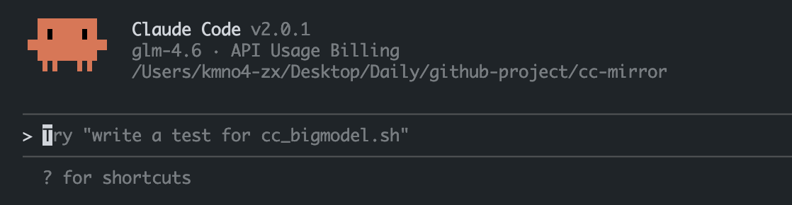

# cc-mirror



Claude Code 是 Anthropic 推出的 AI Agents 工具，功能强大但价格昂贵。本工具提供了一种经济高效的替代方案，让您能够将 Claude Code 切换为各种开源模型。

## ✨ 特性

- 🔄 无缝切换 Claude Code 到开源模型
- 🎯 支持多个主流模型服务平台
- 🚀 简单易用的命令行界面
- 💰 大幅降低使用成本

## 🚀 支持的平台和模型

### [Siliconflow](https://cloud.siliconflow.cn/i/ybUFvmqK)

- moonshotai/Kimi-K2-Instruct
- Qwen/Qwen3-Coder-480B-A35B-Instruct
- zai-org/GLM-4.5
- deepseek-ai/DeepSeek-V3.1

### [DeepSeek](https://platform.deepseek.com/usage)

- deepseek-chat
- deepseek-reasoner

### [Moonshot](https://platform.moonshot.cn/console/account)

- kimi-k2-0711-preview
- kimi-k2-turbo-preview
- kimi-k2-0905-preview
- kimi-k2-thinking

### [BigModel](https://www.bigmodel.cn/claude-code?ic=H0HMCL4V8W)

- GLM-4.6
- GLM-4.5
- GLM-4.5-Air

### [ModelScope](https://www.modelscope.cn/)

- Qwen/Qwen3-Coder-480B-A35B-Instruct
- ZhipuAI/GLM-4.5
- deepseek-ai/DeepSeek-V3.1

## 🚀 快速开始

以 DeepSeek 为例，其他平台操作类似。首先需要在相应的模型服务平台注册账号，并获取 API Key。然后运行相应的脚本即可完成配置。

### 1️⃣ 安装 Claude Code

您可以选择以下任一方式安装：

```bash
bash cc_deepseek.sh
```

或者直接远程安装 GitHub 仓库的脚本：

```bash
curl -O https://raw.githubusercontent.com/KMnO4-zx/cc-mirror/master/cc_deepseek.sh
chmod +x cc_deepseek.sh
./cc_deepseek.sh
```

### 2️⃣ 输入 API Key

运行脚本时，系统会提示您输入模型服务平台的 API Key，按照提示输入即可。


### 3️⃣ 选择模型

使用键盘上的上下方向键选择您想要使用的模型。


### 4️⃣ 应用配置

根据提示，复制相应的命令并在终端中执行，然后重启终端使配置生效：


### 5️⃣ 运行 Claude Code

执行 `claude` 命令，即可进入 Claude Code 并开始使用。


> 💡 **注意**：目前 Claude Code 不支持同时配置多个自定义模型。如需切换模型，请重新执行上述 1-5 步，选择并更新 `ANTHROPIC_MODEL` 环境变量。

## 特别感谢

<div align=center style="margin-top: 30px;">
  <p>感谢所有为本项目做出贡献的开发者们 ❤️</p>
  <a href="https://github.com/KMnO4-zx/cc-mirror/graphs/contributors">
    
  </a>
</div>


## 📚 参考

- 参考教程：[使用开源模型替代 Claude Code](https://mp.weixin.qq.com/s/a9kkGzy2k06bmfquaJJbmQ)
- 项目地址：https://github.com/KMnO4-zx/cc-mirror